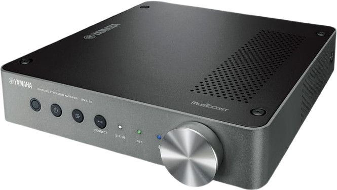

# homebridge-yamaha-wxc-wxa-50

[Homebridge](https://github.com/homebridge/homebridge) plugin for Yamaha `WXC-50` and `WXA-50`.

This fork is based on the original Yamaha receiver plugin, but is intentionally focused on Yamaha streamers/amplifiers that do not expose the same input metadata as classic AV receivers.



## Supported Devices

- `WXC-50`
- `WXA-50`

 &nbsp;


## Requirements

- Set a static IP address for the device
- Enable `Network Standby`
- Check your Node.js version with `node -v`
- Check your Homebridge version with `homebridge -V`

## Features

- Power on/off
- Input switching
- Volume and mute control
- Optional extra volume accessory as `Lightbulb` or `Fan`
- Input name fallback for `WXC-50` / `WXA-50` when Yamaha does not expose classic AVR input metadata
- `AUX` fallback for `WXC-50` / `WXA-50`

## Install In Homebridge

### Option 1: Install from a GitHub release asset

Download the `.tgz` file from the latest GitHub release, then install it into the Homebridge storage path:

```bash
npm --prefix "/var/lib/homebridge" add ./homebridge-yamaha-wxc-wxa-50-0.1.1.tgz
```

You can also install directly from a release asset URL:

```bash
npm --prefix "/var/lib/homebridge" add "https://github.com/luisbozz/homebridge-yamaha-wxc/releases/download/v0.1.1/homebridge-yamaha-wxc-wxa-50-0.1.1.tgz"
```

### Option 2: Install from a local checkout

From this repository:

```bash
npm install
npm pack
npm --prefix "/var/lib/homebridge" add ./homebridge-yamaha-wxc-wxa-50-0.1.1.tgz
```

Restart Homebridge after installation.

## Example Homebridge Config

```json
{
  "platforms": [
    {
      "platform": "YamahaWxcWxa50",
      "debug": false,
      "statePollingInterval": 10,
      "receivers": [
        {
          "name": "Living Room",
          "ip": "192.168.178.149",
          "minVolume": -80,
          "maxVolume": -10,
          "volumeAccessory": "fan"
        }
      ]
    }
  ]
}
```

## Pairing Notes

- During the Apple Home pairing dialog, HomeKit may temporarily show generic input names such as `Input 1` or `Eingabequelle 1`.
- After the accessory is added, the plugin restores and keeps the real names such as `Spotify`, `Bluetooth`, `AirPlay`, `AUX`, and so on.
- Do not uncheck every input during pairing. If all inputs are marked hidden, the input selector will disappear in the Home app.
- If you accidentally hide all inputs, stop Homebridge and remove the plugin cache directory:

```bash
rm -rf /var/lib/homebridge/yamaha-wxc-wxa-50-persist
```

Then start Homebridge again and pair the accessory again.

## Notes

- The plugin publishes one external HomeKit audio receiver accessory per configured device.
- Named inputs are derived from the Yamaha feature list when the device does not expose classic AVR input metadata.
- Generic HomeKit placeholder names are ignored so they do not overwrite the real source names.
- Existing cached placeholder names such as `Input` or `Eingabequelle` are refreshed automatically.

